# scaffold-backend

A Compas & LPC backend template to use as a start for the upcoming projects
within Lightbase.

## Lightbase backend for new devs

This document is intended for new backend developers at Lightbase to provide an
introduction to the Lightbase way of working with Compas and LPC (Lightbase
Platform Components).

Compas is primarily a Koa/Postgres Utility created by Dirk de Visser and is
technically separate from Lightbase. Despite that, the Utility is built with
focus on the processes that often recur within Lightbase projects. For more
information about Compas see: https://compasjs.com/

LPC is used as a complement to Compas for processes such as authentication
communication and file handling. As the name suggests, this package falls
directly under Lightbase.

The Lightbase scaffold in which this document resides is set up with standard
files that are often needed in our projects. It also contains files marked
"dummy". These files, functions, types, seeders etc. are purely for
demonstration and serve as examples. Please take a moment to look at these dummy
files.

## Workflow

> The `dummy` entity that is described in this section is no longer present in
> this code base. But the information is still relevant and accurate as if you
> would normally approach this problem

The following example explains how the dummy entity is set up, migrated, seeded
and can be tested.

First we look at the gen (Generate) directory, this is your start when creating
a new entity. Everything in here will later be converted to different files that
we can use for different processes like querying, creating controllers and
manipulating data.

In the gen directory there are three standard elements. These are type.js for
creating types that recur in the other files, database.js for defining types
that need database functionality such as a migration, queries, data mutation
etc. and finally the seeder.js where you define types for filling tables during
tests.

So the gen directory is mainly for defining types and routes. All entities you
add must be added to the index.js in the gen directory. As first, you import the
entity file, and then you add the entity in extendWithInternal(app). So no magic
happens with compas, everything has to be added manually.

So an example of an entity is "dummy". First, this entity is created in
gen/database.js. Here we give the name dummy as object name and under keys the
properties that dummy needs. You can also see that we do a type reference to
phoneNumber and email. These are both defined by default in gen/types.js and
these types can be retrieved and applied this way without too much duplication.

After creating dummy in gen/database.js, the only thing missing is a route(s).
We create these in their own entity file. Therefore, gen/dummy.js is created.
Here it is defined that on route /dummy/list a list of dummies is shown with a
reference to the type of dummy already defined in gen/database.js.

The only thing for the dummy entity in the gen directory not yet discussed is
the seeder type. This is created in gen/seeder.js. In this example, the seed is
defined with only one mandatory value.

As soon as you add and/or modify any of these elements you can run
`yarn compas generate application` in your CLI. During this process the files in
the gen directory are run and generated so that you can now define controllers
associated with generated API endpoints, you now have the correct type
definitions when creating events, an entity relation diagram is created so that
you can see the database relations in an overview and much more.

Also a structure.sql file is generated in the directory src/generated/common/ so
you can easily copy the sql code for your migration. The migrations are needed
to specify the structure in the postgres database. These migrations can be found
under the directory migrations. A migration should always be created in
ascending order and should not be overwritten under normal circumstances. Should
this be necessary while the backend is already running on a development
environment, the database should first be reset on the development environment
when deploying. As you can see in the file 004-dummy.sql it is completely copied
from the file (src/generated/common/structure.sql) that compas generated for us.
If the project is already running on a production environment, the idea is to
add a new migration.

Once the migration is created and defined we can look at the src directory. This
is the directory where we place our manually written code for the defined and
generated entities. For each entity we create its own directory with the name of
the entity in question. In this case it is dummy.

Within a src entity directory we place the files for the controllers, events,
jobs, seeders and tests. As soon as a controller is created, it must also be
listed in the src/api.js file so that compas can register it when building the
API.

In the controller file of an entity we create handlers in which we can retrieve
the body and parameters of a request and define a context for the response. Here
we also add middleware if needed, for example for sessions. In the case of the
demo we only handle the list route of dummy, and we do that in
src/dummy/controller.js.

In this controller we execute an event defined in src/dummy/events.js. Again,
this is a common flow when working with compas. Ideally all functions, business
logic or mutations are in the entity's event file.

For this demo, we created the event dummyList() to demonstrate how to use the
generated query functions to retrieve everything in the dummy.

After all these steps, you have a basic working API. But before a release can
happen we must of course test that our written code works. Fortunately, this is
fairly easy to do with compas.

In the entity directory we create a test file by adding .test.js after a file.
In this case we want to test the controller, so we created a controller.test.js
file. In this test you can see that we are using the seeder that we defined in
the beginning so that we can seed data on our local environment and test based
on that. The example tests simple cases, and we can easily see if we are
actually getting back what we expect when making a call.

## Getting started

```shell script
yarn

# generate command
yarn compas generate application

# Run required Postgres and S3 services
yarn compas docker up
yarn compas migrate

# run api & queue
yarn compas run api
yarn compas run queue

# run all test cases
yarn compas test --serial

# other commands
yarn compas help
```

## Structure

**Concepts**

- Service: 'Global' state, can be imported everywhere, over writable on tests
  for easy 'mocking'
- Event: A 'reusable' function following a call convention, mostly used for
  abstracting business logic instead of putting it in the controllers
- Controller: The place where route handlers are mounted, does validation and
  authentication checks

**Idea**

The idea is that controllers contains minimal business logic, which instead
should happen in the events. The events should accept an 'Event' structure as
the first parameter. Events should also manage `eventStart` & `eventStop`. These
functions are used for 'instrumenting' the 'call graph'. There are 3 ways to
create an event:

- From a controller use `newEventFromEvent(ctx.event)`
- From an event use `newEventFromEvent(event)`
- From a test use `newTestEvent()`

Testing can happen in multiple places:

- Controller tests, which spin up the server and do calls with the api client
- Event tests, which only put some fixture data in the database and then call an
  event

**Mailtrap**

This scaffold holds a very basic mail setup (`/src/mail/*`) including template
rendering. Depending on the execution context ((unit) tests, or api) the mails
are previewed or send (via Mailtrap or another mail provider). Mailtrap is
mostly used during development or on certain environment (acc, development) in
production, to prevent ~~unwanted~~ emails to be sent out.

Frontend hosts a static directory holding the email template assets. The
convention is as follows; `${FRONTEND_APPILCATION_URL}/mail/${asset}`.

## Services

This backend holds multiple services all separately executed (as services) but
referred to as one single application called the backend. The various services
entrypoint are located in `./scripts/*`. Below is an overview of the service
name and the task of that service. These services/scripts run as separate
instances within the cloud infrastructure.

| Service | Task                                                               |
| ------- | ------------------------------------------------------------------ |
| api     | the router /api service that handles all incoming network requests |
| migrate | ensure postgres is initialized by creating schema's and tables     |
| queue   | various background/recurring jobs or schedules events              |

## Entity diagram

```mermaid
erDiagram
    anonymousLogin {
        uuid id PK
        boolean isAllowedToLogin
        uuid user FK

        string loginToken
        date createdAt
        date updatedAt
    }
    anonymousLogin ||--|| user : "1-1"
    digidLogin {
        uuid id PK
        uuid user FK

        string bsn
        date createdAt
        date updatedAt
    }
    digidLogin ||--|| user : "1-1"
    keycloakLogin {
        uuid id PK
        uuid user FK

        string email
        date createdAt
        date updatedAt
    }
    keycloakLogin ||--|| user : "1-1"
    passwordLogin {
        uuid id PK
        uuid user FK

        string email
        string password
        string otpSecret
        date otpEnabledAt
        date verifiedAt
        date createdAt
        date updatedAt
    }
    passwordLogin ||--|| user : "1-1"
    passwordLoginAttempt {
        uuid id PK
        uuid passwordLogin FK

        date createdAt
        date updatedAt
    }
    passwordLoginAttempt }|--|| passwordLogin : "M-1"
    passwordLoginReset {
        uuid id PK
        boolean shouldSetPassword
        uuid login FK

        string resetToken
        date expiresAt
        date createdAt
        date updatedAt
    }
    passwordLoginReset }|--|| passwordLogin : "M-1"
    permission {
        uuid id PK
        string identifier
    }
    role {
        uuid id PK
        string identifier
        uuid tenant FK

    }
    role }|--o| tenant : "M-1"
    rolePermission {
        uuid id PK
        uuid permission FK

        uuid role FK

        date createdAt
        date updatedAt
    }
    rolePermission }|--|| permission : "M-1"
    rolePermission }|--|| role : "M-1"
    totpSettings {
        uuid id PK
        uuid user FK

        string secret
        date verifiedAt
        date createdAt
        date updatedAt
    }
    totpSettings ||--|| user : "1-1"
    user {
        uuid id PK
        string name
        date lastLogin
        date createdAt
        date updatedAt
        date deletedAt
    }
    userRole {
        uuid id PK
        uuid role FK

        uuid user FK

        date createdAt
        date updatedAt
    }
    userRole }|--|| role : "M-1"
    userRole }|--|| user : "M-1"
    device {
        uuid id PK
        uuid session FK

        string name
        string platform
        string notificationToken
        date createdAt
        date updatedAt
    }
    device ||--|| sessionStore : "1-1"
    featureFlag {
        uuid id PK
        boolean globalValue
        string description
        string name
        date createdAt
        date updatedAt
    }
    tenant {
        uuid id PK
        string name
        any data
    }
    userTenant {
        uuid id PK
        uuid tenant FK

        uuid user FK

    }
    userTenant }|--|| tenant : "M-1"
    userTenant }|--|| user : "M-1"
    userSettings {
        uuid id PK
        uuid user FK

        string email
        string phone
        string notes
        date createdAt
        date updatedAt
    }
    userSettings ||--|| user : "1-1"
    file {
        uuid id PK
        number contentLength
        string bucketName
        string contentType
        string name
        object meta
        date createdAt
        date updatedAt
    }
    job {
        number id PK
        boolean isComplete
        number handlerTimeout
        number priority
        number retryCount
        string name
        date scheduledAt
        any data
        date createdAt
        date updatedAt
    }
    sessionStore {
        uuid id PK
        string checksum
        date revokedAt
        any data
        date createdAt
        date updatedAt
    }
    sessionStoreToken {
        uuid id PK
        uuid session FK

        date expiresAt
        uuid refreshToken FK

        date revokedAt
        date createdAt
    }
    sessionStoreToken |o--|| sessionStoreToken : "1-1"
    sessionStoreToken }|--|| sessionStore : "M-1"
```

<div>



</div>
