# platform-backend-template

A Compas backend platform template to use as a start for new projects.

## Getting started

```shell script
npm install

# generate command
npx compas generate application

# Run required Postgres and S3 services
npx compas docker up
npx compas migrate

# run api & queue
npx compas run api
npx compas run queue

# run all test cases
npx compas test --serial

# other commands
npx compas help
```

## Structure and recommended use

**Concepts**

- Service: 'Global' state, can be imported everywhere, over writable on tests
  for easy 'mocking'
- Event: A 'reusable' function following a call convention, mostly used for
  abstracting business logic instead of putting it in the controllers
- Controller: The place where route handlers are mounted, does validation and
  authentication checks

**Idea**

The idea is that controllers contains minimal business logic, which instead
should happen in the events. The events should accept an 'Event' structure as
the first parameter. Events should also manage `eventStart` & `eventStop`. These
functions are used for 'instrumenting' the 'call graph'. There are 3 ways to
create an event:

- From a controller use `newEventFromEvent(ctx.event)`
- From an event use `newEventFromEvent(event)`
- From a test use `newTestEvent()`

Testing can happen in multiple places:

- Controller tests, which spin up the server and do calls with the api client
- Event tests, which only put some fixture data in the database and then call an
  event

**Mailtrap**

This scaffold holds a very basic mail setup (`/src/mail/*`) including template
rendering. Depending on the execution context ((unit) tests, or api) the mails
are previewed or send (via Mailtrap or another mail provider). Mailtrap is
mostly used during development or on certain environment (acc, development) in
production, to prevent ~~unwanted~~ emails to be sent out.

Frontend hosts a static directory holding the email template assets. The
convention is as follows; `${FRONTEND_APPILCATION_URL}/mail/${asset}`.

## Services

This backend holds multiple services all separately executed (as services) but
referred to as one single application called the backend. The various services
entrypoint are located in `./scripts/*`. Below is an overview of the service
name and the task of that service. These services/scripts run as separate
instances within the cloud infrastructure.

| Service | Task                                                               |
| ------- | ------------------------------------------------------------------ |
| api     | the router /api service that handles all incoming network requests |
| migrate | ensure postgres is initialized by creating schema's and tables     |
| queue   | various background/recurring jobs or schedules events              |

## Entity diagram

```mermaid
erDiagram
    anonymousLogin {
        uuid id PK
        boolean isAllowedToLogin
        uuid user FK

        string loginToken
        date createdAt
        date updatedAt
    }
    anonymousLogin ||--|| user : "1-1"
    digidLogin {
        uuid id PK
        uuid user FK

        string bsn
        date createdAt
        date updatedAt
    }
    digidLogin ||--|| user : "1-1"
    keycloakLogin {
        uuid id PK
        uuid user FK

        string email
        date createdAt
        date updatedAt
    }
    keycloakLogin ||--|| user : "1-1"
    passwordLogin {
        uuid id PK
        uuid user FK

        string email
        string password
        string otpSecret
        date otpEnabledAt
        date verifiedAt
        date createdAt
        date updatedAt
    }
    passwordLogin ||--|| user : "1-1"
    passwordLoginAttempt {
        uuid id PK
        uuid passwordLogin FK

        date createdAt
        date updatedAt
    }
    passwordLoginAttempt }|--|| passwordLogin : "M-1"
    passwordLoginReset {
        uuid id PK
        boolean shouldSetPassword
        uuid login FK

        string resetToken
        date expiresAt
        date createdAt
        date updatedAt
    }
    passwordLoginReset }|--|| passwordLogin : "M-1"
    permission {
        uuid id PK
        string identifier
    }
    role {
        uuid id PK
        string identifier
        uuid tenant FK

    }
    role }|--o| tenant : "M-1"
    rolePermission {
        uuid id PK
        uuid permission FK

        uuid role FK

        date createdAt
        date updatedAt
    }
    rolePermission }|--|| permission : "M-1"
    rolePermission }|--|| role : "M-1"
    totpSettings {
        uuid id PK
        uuid user FK

        string secret
        date verifiedAt
        date createdAt
        date updatedAt
    }
    totpSettings ||--|| user : "1-1"
    user {
        uuid id PK
        string name
        date lastLogin
        date createdAt
        date updatedAt
        date deletedAt
    }
    userRole {
        uuid id PK
        uuid role FK

        uuid user FK

        date createdAt
        date updatedAt
    }
    userRole }|--|| role : "M-1"
    userRole }|--|| user : "M-1"
    device {
        uuid id PK
        uuid session FK

        string name
        string platform
        string notificationToken
        object webPushInformation
        date createdAt
        date updatedAt
    }
    device ||--|| sessionStore : "1-1"
    featureFlag {
        uuid id PK
        boolean globalValue
        string description
        string name
        generic tenantValues
        date createdAt
        date updatedAt
    }
    tenant {
        uuid id PK
        string name
        any data
    }
    userTenant {
        uuid id PK
        uuid tenant FK

        uuid user FK

    }
    userTenant }|--|| tenant : "M-1"
    userTenant }|--|| user : "M-1"
    userSettings {
        uuid id PK
        uuid user FK

        string email
        string phone
        string notes
        date createdAt
        date updatedAt
    }
    userSettings ||--|| user : "1-1"
    file {
        uuid id PK
        number contentLength
        string bucketName
        string contentType
        string name
        object meta
        date createdAt
        date updatedAt
    }
    job {
        number id PK
        boolean isComplete
        number handlerTimeout
        number priority
        number retryCount
        string name
        date scheduledAt
        any data
        date createdAt
        date updatedAt
    }
    sessionStore {
        uuid id PK
        string checksum
        date revokedAt
        any data
        date createdAt
        date updatedAt
    }
    sessionStoreToken {
        uuid id PK
        uuid session FK

        date expiresAt
        uuid refreshToken FK

        date revokedAt
        date createdAt
    }
    sessionStoreToken |o--|| sessionStoreToken : "1-1"
    sessionStoreToken }|--|| sessionStore : "M-1"
```

<div>



</div>
