# @lightbasenl/backend

Part of [lightbase](https://lightbase.nl) platforms components library. Features
an integratable and extendable multitenant and auth systems.

## TOC

- [Installation](#installation)
- [Features](#features)
- [Database structure](#database-structure)
- [Migrations](#migrations)
- [Usage](#usage)
  - [Definitions](#definitions)
  - [Minimal backend setup](#minimal-backend-setup)
  - [Tenant configuration](#tenant-configuration)
  - [Examples](#examples)

## Installation

This package is vendored automatically by Lightbase Sync.

## Features

- Config based multitenant support
  - Single tenant
  - Multi tenant
  - Multiple urls per tenant
  - Support development, acceptance and production specific urls
- Feature flag support
  - Static definition
  - Test values
- User support
  - Automatic handling of access to all tenants
  - Restrict to single tenant or allow multiple tenants
- Various ways of user authentication
  - Password based flows
  - Keycloak based flows
  - DigiD based flows
  - Anonymous user flows
- Two-step authentication with totp tokens
- Permission based access control with role management.
  - Global 'uneditable' roles
  - Dynamic roles per tenant
- Session and device management
  - Enforce device to be provided
  - Logout other devices
  - Impersonate other users
- Platform management
  - Magic auth via Lightbase Slack workspace
  - Manage feature flags

## Database structure

- tenant: Main tenant table, should be used for adding relations to.
- featureFlag: the current feature flag state for the specific deployment.
- user: Main user table, should be used for adding relations to.
- device: each session has 1 device. The session is 'softly' coupled to user
- userTenant: User relation to tenants, many-many.
- passwordLogin: Store password login credentials and if the email is verified
- passwordLoginReset: Reset & verify tokens for the password login
- anonymousLogin: Anonymous session tokens and anonymous login support
- digidLogin: Store BSN's to support a DigiD based login
- keycloakLogin: Store emails to support Keycloak login
- totpSettings: TOTP based 2-fa configuration
- role: Role identifier
- permission: Unique permission identifiers
- userRole: Many-to-Many relation between user and role
- rolePermission: Many-to-Many relation between role and permission

```mermaid
erDiagram
    anonymousLogin {
        uuid id PK
        boolean isAllowedToLogin
        uuid user FK

        string loginToken
        date createdAt
        date updatedAt
    }
    anonymousLogin ||--|| user : "1-1"
    digidLogin {
        uuid id PK
        uuid user FK

        string bsn
        date createdAt
        date updatedAt
    }
    digidLogin ||--|| user : "1-1"
    keycloakLogin {
        uuid id PK
        uuid user FK

        string email
        date createdAt
        date updatedAt
    }
    keycloakLogin ||--|| user : "1-1"
    passwordLogin {
        uuid id PK
        uuid user FK

        string email
        string password
        string otpSecret
        date otpEnabledAt
        date verifiedAt
        date createdAt
        date updatedAt
    }
    passwordLogin ||--|| user : "1-1"
    passwordLoginAttempt {
        uuid id PK
        uuid passwordLogin FK

        date createdAt
        date updatedAt
    }
    passwordLoginAttempt }|--|| passwordLogin : "M-1"
    passwordLoginReset {
        uuid id PK
        boolean shouldSetPassword
        uuid login FK

        string resetToken
        date expiresAt
        date createdAt
        date updatedAt
    }
    passwordLoginReset }|--|| passwordLogin : "M-1"
    permission {
        uuid id PK
        string identifier
    }
    role {
        uuid id PK
        string identifier
        uuid tenant FK

    }
    role }|--o| tenant : "M-1"
    rolePermission {
        uuid id PK
        uuid permission FK

        uuid role FK

        date createdAt
        date updatedAt
    }
    rolePermission }|--|| permission : "M-1"
    rolePermission }|--|| role : "M-1"
    totpSettings {
        uuid id PK
        uuid user FK

        string secret
        date verifiedAt
        date createdAt
        date updatedAt
    }
    totpSettings ||--|| user : "1-1"
    user {
        uuid id PK
        string name
        date lastLogin
        date createdAt
        date updatedAt
        date deletedAt
    }
    userRole {
        uuid id PK
        uuid role FK

        uuid user FK

        date createdAt
        date updatedAt
    }
    userRole }|--|| role : "M-1"
    userRole }|--|| user : "M-1"
    device {
        uuid id PK
        uuid session FK

        string name
        string platform
        string notificationToken
        date createdAt
        date updatedAt
    }
    device ||--|| sessionStore : "1-1"
    featureFlag {
        uuid id PK
        boolean globalValue
        string description
        string name
        date createdAt
        date updatedAt
    }
    tenant {
        uuid id PK
        string name
        any data
    }
    userTenant {
        uuid id PK
        uuid tenant FK

        uuid user FK

    }
    userTenant }|--|| tenant : "M-1"
    userTenant }|--|| user : "M-1"
    file {
        uuid id PK
        number contentLength
        string bucketName
        string contentType
        string name
        object meta
        date createdAt
        date updatedAt
    }
    job {
        number id PK
        boolean isComplete
        number handlerTimeout
        number priority
        number retryCount
        string name
        date scheduledAt
        any data
        date createdAt
        date updatedAt
    }
    sessionStore {
        uuid id PK
        string checksum
        date revokedAt
        any data
        date createdAt
        date updatedAt
    }
    sessionStoreToken {
        uuid id PK
        uuid session FK

        date expiresAt
        uuid refreshToken FK

        date revokedAt
        date createdAt
    }
    sessionStoreToken |o--|| sessionStoreToken : "1-1"
    sessionStoreToken }|--|| sessionStore : "M-1"
```

<div>



</div>

### Migrations

See [migrations](../../docs/migrations.md)

## Usage

### Definitions

- **User**: Anything (people / machine) that can in some way or form interact
  with the platform api.
- **Auth**: Authentication and authorization system based on Users and tenants.
- **Tenant**: A provider on a platform. The most bare-bones use of this package
  requires at least a single tenant to be configured.
- **Multitenant**: A way for multiple Tenants to co-exist on a single platform.
  Sharing logic, but able to have configurable settings like white-labeling.
- **Feature-flag**: A way to enable / disable features for specific
  environments.

### Minimal backend setup

This setup is always necessary, and all other features require that this is
done.

- Install `@lightbasenl/backend`, see
  [here](https://github.com/lightbasenl/platform-components#error) if you have
  problems installing this package.
- Add the [migration](../../docs/migrations.md#lightbasenlbackend) to your
  migrations directory. See the [CHANGELOG](./CHANGELOG.md) for migration
  updates if required.
- In your Compas generate setup add the following and regenerate;

```js
export async function main() {
  // ...App creation

  // Always mandatory;
  extendWithBackendBase(app);

  // Required if management panel is enabled
  extendWithManagement(app);

  // Only necessary if feature flags are used
  await extendWithFeatureFlags(app, {
    /* opts */
  });

  // Only necessary if the features are used in this platform.
  // They can be removed or added individually
  await extendWithAuthAnonymousBased(app);
  await extendWithAuthDigiDBased(app);
  await extendWithAuthKeycloakBased(app, {
    /* opts */
  });
  await extendWithAuthPasswordBased(app);
  await extendWithAuthPermission(app, {
    /* opts */
  });
  await extendWithAuthTotpProvider(app);

  // ...Platform specific definitions & app.generate call
}
```

- Create a `config/tenants.js` file + notify the Core team that you use
  multitenant features. See [Tenant configuration](#tenant-configuration) for
  more information. This way they will setup automatic sync of the
  `config/tenants.js` file to the frontend repository.
- Execute the necessary init sequence in both `service.js` as well as
  `testing.js`

```js
// Use the `corsOrigin` as the 'headers.cors.origin' value to `getApp`.
const { corsOrgin } = backendGetConfig(/* args */);

await backendInitServices(/* args */);

await backendInit(/* args */);
```

This sets up all common types, the database structure and ensures that
multitenant and the authentication and authorization basics work. Allowing you
to start working on the real platform features straight away. Note that the
`backendInit` function acquires a temporary lock, preventing multiple instances
of your platform, like the queue and api, from messing up the synchronization of
tenants and permissions.

### Tenant configuration

We use a configuration file for defining the tenants. Automatically syncing the
same file from the backend repo to the frontend repository. This means that only
shared environment variables or shared dependencies can be used when creating
this configuration. The returned configuration object is a key value map of
tenant name, and its configuration with the following keys:

- The `data` property is a free-form object and stored in the database. This
  should contain all properties that need to be known by both backend and
  frontend for that tenant. It is up to the platform to validate the structure
  of that object.
- The `urlConfig` is another key-value map, but now based on the public urls
  that tenant should be accessible on. When all public urls are disabled because
  of the `environment' the tenant is disabled and not synced to the database.
  - `environment` is only handled by the backend and enables or disables certain
    hosts for certain environments. The environment is selected based on the
    mandatory `LPC_BACKEND_ENVIRONMENT` environment variable.
  - `apiUrl` the api url that belongs to that public url. This doesn't have to
    be unique.

```json
{
  "tenants": {
    "lightbase": {
      "data": {
        "//": "Free form object"
      },
      "urlConfig": {
        "lightbase.nl": {
          "environment": "production",
          "apiUrl": "api.lightbase.nl"
        },
        "acc.lightbase.nl": {
          "environment": "acceptance",
          "apiUrl": "api.acc.lightbase.nl"
        },
        "dev.lightbase.nl": {
          "environment": "development",
          "apiUrl": "api.dev.lightbase.nl"
        }
      }
    }
  }
}
```

Clients can call without extra configuration against a tenant-aware API if the
following conditions are met:

- The api runs on a remote server, so our
  `api.acme.dev.lightbase.nl, api.acme.acc.lightbase.nl and api.acme.com`
  environments
- All tenants known to the api in its current environment have a unique api url.
  This is always true for single tenant platforms, and holds up for all our
  multitenant platforms except for Fleetbook.

In other cases like developing against a local api, the `x-lpc-tenant-origin`
header is mandatory.

### Examples

#### Single tenant backend setup

When the project is not expected to ever be multitenant. You can ignore `tenant`
in a lot of places, but are still tied to the structure, init sequence and user
checks;

- The setup requirements as documented above, are always mandatory.
- Use `multitenant.syncUsersAcrossAllTenants: true` option when calling
  `backendInit`
- Use `withMultitenant.syncUsersAcrossAllTenants: true` option when calling
  `authCreateUser`. This will add the user to all existing tenants.
- You don't have to use the relations to tenant.
- You should still use `multitenantRequireTenant` or `backendGetTenantAndUser`,
  to get the current public url for use with rendering emails or returning urls
  in responses.

#### Multitenant backend setup

There are two supported ways to do multitenancy;

- Single deployment multiple tenants
- Each tenant their own deployment and database

If each tenant uses their own deployment and database, you can use the rules
from [single tenant setup](#single-tenant-backend-setup).

For a single deployment that supports multiple tenants there are a few things to
decide on;

- Are users allowed to access all tenants? Do you create separate flows to give
  an user access to a different tenant? See
  [User per tenant configuration](#user-per-tenant-configuration) below for the
  different options.
- You also need to add relations from your entities to tenants as well, ensuring
  that users won't see data from a single tenant in another tenant. Use
  `backendGetTenantAndUser` to verify if the user can access the tenant, and
  pass `tenant` and `user` through your events, to filter on data only
  accessible to the current tenant and user. This is necessary to ensure that a
  user which has access to multiple tenants, can only see their data for the
  current tenant that they are on.

#### Frontend tenant setup

Frontends don't have to differentiate between single- or multitenant setup. See
[Vercel platforms](https://github.com/vercel/platforms) for a way to manage it
all, but use the tenant configuration as your data source. Some steps to take;
intentionally a bit vague, since this is never tested.

1. Add all known `publicUrl`'s as image domains in `next.config.js`

```js
const imageDomains = Object.values(config().tenants)
  .map((it) => Object.keys(it.urlConfig))
  .flat();

module.exports = {
  images: {
    domains: imageDomains,
  },
};
```

2. Adapt
   [`_middlware.js`](https://github.com/vercel/platforms/blob/main/pages/_middleware.js)
   and setup `_site/[full_url]` pages to our needs.

3. Use the `apiUrl` based on `[full_url]`, i.e.
   `Object.values(config().tenants).find((it) => it.urlConfig[full_url]?.apiUrl)`

For development you can force set the `x-lpc-tenant-origin` header to force the
backend to use a specific tenant. The value of this header should be a
'publicUrl' that is enabled in the development environment. This works both
against a local running api and a production api running in development, like
our `development` environments (e.g. `*.dev.lightbase.nl`).

#### Feature flag setup and usage

Feature flags should have a static definition somewhere in the backend. We
create a `featureFlagDefinition` constant in `src/constants.js`. This is only a
definition that can then be passed to `extendWithFeatureFlag` and
`backendInitServices`. Flag identifiers must start with `__FEATURE` and only use
underscores and upper case letters.

```js
// src/constants.js
/**
 * @type {BackendFeatureFlagDefinitionInput}
 */
export const featureFlags = {
  availableFlags: [
    "__FEATURE_REVIEW_IN_PROGRESS_STATE",
    "__FEATURE_REVIEW_FLOW",
  ],
};
```

In the backend this feature flag definition should be passed to
`extendWithFeatureFlags` to generate the routes and added to your
`backendInitServices` call so backend functions and the controller knows which
flags exist. Flag values can be fetched by calling `featureFlagGetDynamic` on
the backend or `useFeatureFlagCurrent` on the frontend. The returned values here
are always booleans. Use flags as high up in your code as possible for example:

```jsx
// backend
fooHandlers.bar = async (ctx, next) => {
  // ... tenant and user checks

  if (
    featureFlagGetDynamic(
      newEventFromEvent(ctx.event),
      tenant,
      user,
      "__FEATURE_CLIENT_SEARCH",
    )
  ) {
    ctx.body = await newSearchImplementation();
  } else {
    ctx.body = await oldSearchImplementation();
  }
};

// frontend
export function getStaticProps() {
  // ... preload flags
}

export default MyPage();
{
  const { data: flags } = useFeatureFlagCurrent();

  return (
    <Layout>
      (flags.__FEATURE_REACT_TABLE_REFACTOR ? <NewTable /> : <OldTable />)
    </Layout>
  );
}
```

To set the initial feature flag value for use in testing, you can use
`featureFlagSetDynamic`. Your flows should be tested with the feature flag
enabled or disabled.

#### Backend testing

Tests also expect that the full setup as described above is also done in
`injectTestServices`. We provide a few more utilities to make testing with
different tenants and users easier;

Tenants:

- Tenants are not dynamic, so your tests will contain references to tenants
  defined in the tenant configuration, eg via
  `multitenantRequireTenant("tenantName")`.
- We provide `multitenantInjectAxios` to set a tenant that you want to be used
  for api calls in controller tests. In single tenant applications you can
  hardcode it in your `createAndInjectAxiosInstance` function. For multitenant
  setups this is possible as well, but you may need to call
  `multitenantInjectAxios` in your controller tests anyways to check if data
  doesn't leak to other tenants.

Feature flags:

- Feature flags are not dynamic, so your tests should only use feature flags
  that are provided in the definition.
- Feature flags are disabled by default. You can enable or disable them in your
  test via `featureFlagSetDynamic`.

Users:

- `authTestCreateUser` is `authCreateUser` but on steriods, with useful defaults
  like being able to login on each tenant. It also creates roles dynamically for
  the provided permission set, which also enforces you to use permission based
  access and not rely on hardcoded role checks.
- If the anonymous based providers is enabled in your platform, it is advised to
  be used as much as possible in tests. It is the fastest way to seed and login;

```js
const user = await authTestCreateUser(newTestEvent(t), sql, {
  withAnonymousBased: {}, // withPermissions: {
  //   permissions: [permission.fooBar]
  // }
});

await apiAuthAnonymousBasedLogin(axiosInstance, {
  token: user.anonymousLogin.loginToken,
});
```

- If `withPasswordBased` is used, the resulting `user.passwordLogin.password`
  will be the plain text password instead of the password hash. This way you can
  call
  `apiAuthPasswordBasedLogin(axiosInstance, { email user.passwordLogin.email, password: user.passwordLogin.password })`.
- We provided `authInjectTokenInterceptors` to catch login tokens, provided that
  they are in the same response structure as `apiAuthPasswordBasedLogin` uses.
  This way you don't have to juggle tokens, set headers, etc.

#### User per tenant configuration

This package always requires the current user to be related to the current
tenant. There are a few supported configurations:

- A user has access to all tenants
- A user has access to a selection of tenants

**Access to all tenants**

- In `backendInit` pass in `multitenant.syncUsersAcrossAllTenants: true`. This
  syncs all users to all tenants
- To `authCreateUser` pass in `withMultitenant.syncUsersAcrossAllTenants: true`,
  adding the user to all existing tenants.

**Access to a selection of tenants**

- Dedupe users manually in the platform. The keycloak based authentication
  provider will do this for you, for others you can use `authUserAddTenant` with
  the option to limit users to a single tenant.

#### Permission setup

Authorization is done by checking on permissions in the platform. Permissions
are assigned to users via roles, which can be static or dynamic. The permissions
themselves need to be static so that they can be synced to users and be used
while generating api definitions. Pass `auth.permissionIdentifiers` to
`backendInit` to ensure that you can use these permissions. You also need to add
the permissions used by LPC backend, via `Object.values(authPermissions)` to
this array.

Roles can be set up to be static as well, by specifying `auth.mandatoryRoles` to
`backendInit` the roles will be synced to the database, and the `isEditable`
property returned on the `apiAuthPermissionRoleList` will be false. Adding roles
to users goes via `authPermissionUserSyncRoles` or use of
`apiAuthPermissionUserAddRole` and `apiAuthPermissionUserRemoveRole` api's.

Note that you seperately need to add the structure for `authPermission` to your
app via `extendWithAuthPermission`.

#### Device and session management

End users can be put in charge of managing their own sessions. This happens in
combination with device information.

```ts
backendInitServices(app, sql, {
  sessionDeviceSettings: {
    // Optional; limit the number of a sessions a mobile user can have.
    allowedNumberOfMobileDeviceSessions: 2, // Optional; enforce that all login routes expect device information. This ensures that each session has device information, which allows device management.
    requireDeviceInformationOnLogin: true,
  },
});
```

The following routes are useful for this system;

- `useSessionList`: get a list of sessions for the current logged in user
- `useSessionSetDeviceNotificationToken`: add a notification token to the
  device. This token is not used by LPC but could be used by platforms.
- `useSessionLogout`: Logout another session for this user.

#### Authentication providers

LPC also comes with variuos authentication providers, each with their own
feature set. Each of them can be turned on individually by passing in
`auth.$provider.controller` to `backendInit`. As mentioned in the
[setup](#minimal-backend-setup), you need to add the Compas structure for these
providers manually.

**Password based**

The password based provider is a full system to handle email + password based
authentication. The flow described below will give information about the events
fired and errors that are thrown. Note that api calls that don't describe a body
will return the so called `success response`, which is basically a 200-response
without any useful body.

Enabling the flow requires two steps: applying the structure and applying the
logic. To apply the structure call `extendWithAuthPasswordBased`. This will
create some types and route handlers. The logic can be applied via the
`applyAuth` function. This supports the property `passwordBased` which should
contain an object with the generated controller, `authPasswordBased`.

Password based is able to force the user to update their password after
6-months, to ensure password rotation. This can be set via `backendInitServices`
and could result in a `session.type === "passwordBasedUpdatePassword"` session.
This is checked after TOTP if necessary. The user is then only able to call
`useAuthPasswordBasedUpdatePassword` and is logged out afterwards, forcing a re
login.

It also supports blocking login attempts for a login when more than 10 requests
are done in a rolling 5 minute interval. This results in the
`authPasswordBased.login.maxAttemptsExceeded` error.

**Anonymous based**

The anonymous based login provider contains a system for creating anonymous
users both internally and externally.

- Internal users are api users that need a session for example for storing flow
  data, but don't need to log in.
- External users are handled the same, but the token may be shared with the user
  via a magic link, and they may log in multiple times.

Enabling the flow requires two steps: applying the structure and applying the
logic. To apply the structure call `extendWithAuthAnonymousBased`. This will
create some types and route handlers. The logic can be applied via the
`applyAuth` function. This supports the property `AnonymousBased` which should
contain an object with the generated controller, `authAnonymousBased`.

**DigiD based**

The DigiD based provider does a lot of assumptions about the usage, and
currently only supports the simple single login flow. It is expected that
platforms store the public and private key necessary.

This provider is shaped because of the usage in PGR, this does not mean it's the
most optimal api, so changes can and will happen.

**Keycloak based**

The Keycloak based provider allows to make a LPC session from a Keycloak
session. It uses email as the common identifier between the systems. Note that
these flows are not tested at all yet.

**TOTP provider**

The TOTP provider, provides a way to add two-step authentication to any login
provider like `passwordBased` and `anonymousBased`.

`authRequireUser` throws by default if the user is in the `checkTwoStep` phase.
If multiple two-step checkers are available, any of them will, on successful
verification, advance the session type to 'user'. On routes that may be
accessible when the two-step is not verified yet, pass in
`skipSessionIsUserCheck: true`.

Enabling the flow requires two steps: applying the structure and applying the
logic. To apply the structure call `extendWithTotpProvider`. This will create
some types and route handlers. The logic can be applied via the `applyAuth`
function. This supports the property `totpProvider` which should contain an
object with the generated controller, `authTotpProvider`.

#### Background jobs

This package inserts events in to the Compas job queue in various flows,
allowing you to send things like emails for user registration flows.

**`auth.user.softDeleted`**

Fired when a user is soft deleted via `authSetUserActive` with the following
data object (`AuthUserSoftDeletedEventData`):

```json
{
  "userId": "uuid",
  "metadata": {
    "tenant": {
      "id": "uuid",
      "publicUrl": "https://foo.bar.lightbase.nl",
      "apiUrl": "https://api.foo.bar.lightbase.nl"
    }
  }
}
```

**`authEventNames.authPasswordBasedUserRegistered`**:

Fired on successful registration via `authPasswordBasedRegister` with the
following data object (`AuthPasswordBasedUserRegisteredEventData`):

```json
{
  "passwordLoginId": "uuid",
  "passwordLoginResetId": "uuid",
  "metadata": {}
}
```

The reset token on the `passwordLoginResetId` can safely be sent in an email.

**`authEventNames.authPasswordBasedLoginVerified`**:

Fired on successful email verification via `apiAuthPasswordBasedVerifyEmail`
with the following data object (`AuthPasswordBasedLoginVerifiedEventData`):

```json
{
  "passwordLoginId": "uuid",
  "metadata": {
    "tenant": {
      "id": "uuid",
      "publicUrl": "https://foo.bar.lightbase.nl",
      "apiUrl": "https://api.foo.bar.lightbase.nl"
    }
  }
}
```

**`authEventNames.authPasswordBasedForgotPassword`**:

Fired on successful `passwordLoginReset` creation via
`apiAuthPasswordBasedForgotPassword` with the following data object
(`AuthPasswordBasedForgotPasswordEventData`):

```json
{
  "passwordLoginId": "uuid",
  "passwordLoginResetId": "uuid",
  "metadata": {
    "tenant": {
      "id": "uuid",
      "publicUrl": "https://foo.bar.lightbase.nl",
      "apiUrl": "https://api.foo.bar.lightbase.nl"
    }
  }
}
```

**`authEventNames.authPasswordBasedPasswordReset`**:

Fired on successful password reset via `apiAuthPasswordBasedResetPassword` with
the following data object (`AuthPasswordBasedPasswordResetEventData`):

```json
{
  "passwordLoginId": "uuid",
  "metadata": {
    "tenant": {
      "id": "uuid",
      "publicUrl": "https://foo.bar.lightbase.nl",
      "apiUrl": "https://api.foo.bar.lightbase.nl"
    }
  }
}
```

**`authEventNames.authPasswordBasedEmailUpdated`**:

Fired after a successful email change via `apiAuthPasswordBasedUpdateEmail` with
the following data object (`AuthPasswordBasedEmailUpdatedEventData`):

```json
{
  "previousEmail": "string",
  "passwordLoginId": "uuid",
  "passwordLoginResetId": "uuid",
  "metadata": {
    "tenant": {
      "id": "uuid",
      "publicUrl": "https://foo.bar.lightbase.nl",
      "apiUrl": "https://api.foo.bar.lightbase.nl"
    }
  }
}
```

**`authEventNames.authPasswordBasedPasswordUpdated`**:

Fired after a successful password update via
`apiAuthPasswordBasedUpdatePassword` with the following data object
(`AuthPasswordBasedPasswordUpdatedEventData`):

```json
{
  "passwordLoginId": "uuid",
  "metadata": {
    "tenant": {
      "id": "uuid",
      "publicUrl": "https://foo.bar.lightbase.nl",
      "apiUrl": "https://api.foo.bar.lightbase.nl"
    }
  }
}
```

**`authEventNames.authPasswordBasedRequestOtp`**:

Fired after a password based login for a user that has `otpEnabledAt` set. With
the following data object (`AuthPasswordBasedRequestOtpEventData`):

```json
{
  "userId": "uuid",
  "passwordLoginId": "uuid",
  "otp": "123456",
  "metadata": {
    "tenant": {
      "id": "uuid",
      "publicUrl": "https://foo.bar.lightbase.nl",
      "apiUrl": "https://api.foo.bar.lightbase.nl"
    }
  }
}
```

**`authEventNames.authAnonymousBasedUserRegistered`**:

on successful registration via `authAnonymousBasedRegister` with the following
data object (`AuthAnonymousBasedUserRegisteredEventData`):

```json
{
  "anonymousLoginId": "uuid",
  "metadata": {}
}
```

#### User and tenant settings

In many cases the platforms needs custom properties for either the user or
tenant, which are used on quite a few routes. LPC backend facilitates this via
the steps below. For this example we use `tenantSettings` and add it to the
tenant (`T.reference("backend", "tenant")`), but the same can be done for the
user (`T.reference("auth", "user")`).

1. Create database entity and add the relation;

```js
T.object("tenantSettings")
  .keys({
    termsOfUse: T.string(),
  })
  .relations(
    T.oneToOne("tenant", T.reference("backend", "tenant"), "settings"),
  );
```

2. Let LPC include settings automatically

```js
// In service.js / testing.js
import { queries } from "./generated/database/index.js";
import { queryTenant } from "./generated/database/tenant.js";

backendInitQueries(
  queries,
  {
    queryTenant,
  },
  {
    tenantBuilder: {
      settings: {},
    },
  },
);
```

3. Use the new settings. All of `authRequireUser`, `multitenantRequireTenant`
   and `backendGetTenantAndUser` will respect the passed in builder and return a
   `user` or `tenant` with the extra builder added. In this cases
   `tenant.settings` is available if you created did an
   `queries.tenantSettingsInsert` earlier for that tenant.

#### 2FA

LPC supports two step checks via both TOTP tokens and via email
(`passwordBased`). Each have different setups;

**TOTP**:

Use the `apiAuthTotpProviderInfo` for information if the user did setup totp
already. A full setup requires usage of `apiAuthTotpProviderSetup` and
`apiAuthTotpProviderSetupVerify`.

**Email based**:

Set the `otpEnabledAt` property on `passwordLogin` to any date value, either via
a direct query or the corresponding options on `authCreateUse` or
`authPasswordBasedRegister`. LPC automatically generates a secret and uses it.
If `apiAuthPasswordBasedLogin` is used and the user has `otpEnabledAt` the
`authEventNames.authPasswordBasedRequestOtp` ( see above in this document) job
is fired, with a valid otp.

The TOTP method is preferred to be used, and is also preferred if the user has
set up both.

In both cases after log in the `apiAuthMe` call will only return the `session`
object, with `type` set to `checkTwoStep` . In this case the user can only call
api routes which don't do auth checks, or ones which use the
`skipSessionIsUserCheck: true` on `authRequireUser` (or
`backendGetTenantAndUse`). The `session.twoStepType` is set to the required 2FA
method. Once completed via either `apiAuthTotpProviderVerify` or
`apiAuthPasswordBasedVerifyOtp`, the session is automatically upgraded to
`session.type = 'user'` without issuing new tokens.

#### Impersonating another user

Via `authImpersonateStartSession` any backend can allow a user to act on behalf
of another user. This works by replacing the `userId` in the session. Backends
can detect if an impersonating session is going on by using
`authImpersonateIsInSession`, frontends can detect it based on
`session.impersonatorUserId` returned by `useAuthMe`. Stopping the session can
only be done in the frontends via `useAuthImpersonateStopSession`. This all
works on the already active session, so no new access token is returned.
